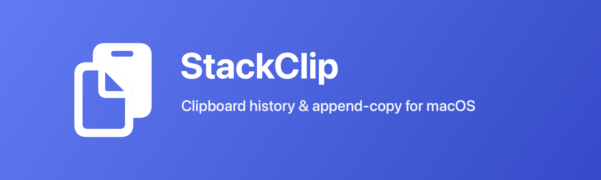

<p align="center"></p>

# StackClip

A tiny macOS menu bar utility that adds two missing clipboard features:

- **Append copy** — press **⌘⇧C** to copy the current selection *onto the end* of what's already on your clipboard, instead of replacing it. Collect snippets from several places, paste them all at once.
- **Clipboard history** — like Windows' Win+V. The menu bar icon lists your last 50 copied texts; click one to put it back on the clipboard. History survives restarts.

Passwords are safe: copies marked as concealed (the convention used by password managers, `org.nspasteboard.ConcealedType`) are never recorded.

## Install

**Download the app:** grab `StackClip.zip` from the [Releases](https://github.com/nonamexishere/StackClip/releases) page, unzip it, and drag **StackClip.app** to your Applications folder.

Because the app isn't notarized yet, the first launch needs a right-click: **right-click StackClip.app → Open → Open**. After that it opens normally.

1. Click the menu bar icon → **Launch at Login** so it starts automatically.
2. The first time you press ⌘⇧C, grant **Accessibility** access when prompted (or via the menu's warning item) so it can read your selection.

## Build from source

Requires macOS 13+ and Xcode (or the Swift toolchain).

```sh
swift build -c release
.build/release/StackClip
```

Or during development: `swift run StackClip`.

## Accessibility permission

Append copy reads your current selection through the macOS **Accessibility** API, so the app needs Accessibility access. While permission is missing, the status menu shows a **"⚠️ Append Copy needs Accessibility access…"** item — click it to jump straight to **System Settings → Privacy & Security → Accessibility**. Pressing ⌘⇧C without permission beeps and opens the same pane. Grant the permission, then restart the app.

Note: when you launch StackClip from a terminal, macOS attributes the permission to your *terminal app* — grant it there and it persists across rebuilds. If you run the binary directly, the grant is tied to the binary's signature and resets on every rebuild.

## Usage

1. Copy something normally (⌘C).
2. Select more text anywhere and press **⌘⇧C** — it's appended to the clipboard. On success the menu bar icon briefly turns into a checkmark and plays a "Tink"; if nothing copyable was selected, you get a beep.
3. Paste (⌘V) to get everything at once.
4. Click the clipboard icon in the menu bar to browse history; click an entry to restore it. While the menu is open, pressing a bare digit **1–9** picks the corresponding entry, and hovering an entry shows a tooltip with more of its text.
5. Pick how appended snippets are joined via the **Append Separator** submenu: **New Line** (default), **Space**, or **Tab**. The choice is remembered across restarts.

## Roadmap

- [x] Configurable separator (newline / space / tab)
- [x] Proper `.app` bundle + downloadable release + Launch at Login
- [ ] Signed & notarized build (Homebrew cask)
- [ ] Configurable hotkey
- [ ] Paste-on-click option for history items

## License

[MIT](LICENSE)
